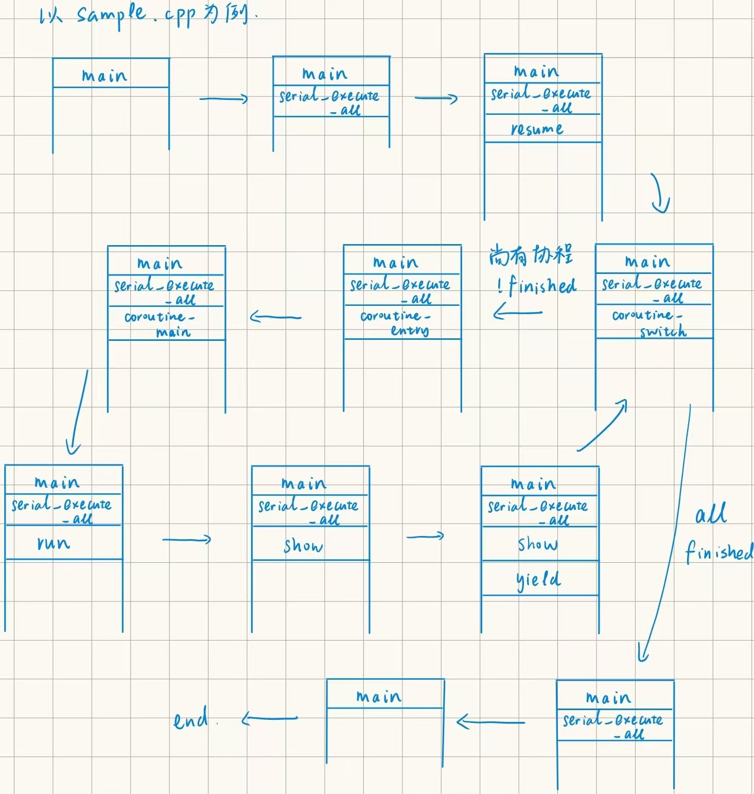
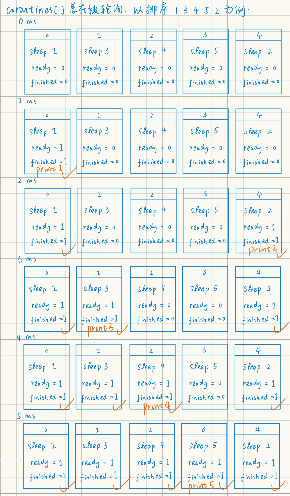

# Coroutine Lab Report

## Task 1: 协程库的编写

### 完成本任务添加的代码（添加了注释来说明用途）
`context.S`

``` assembly
.global coroutine_switch
coroutine_switch:
    # TODO: Task 1
    # 保存 callee-saved 寄存器到 %rdi 指向的上下文
    # 保存的上下文中 rip 指向 ret 指令的地址（.coroutine_ret）
    movq %rsp, 64(%rdi) # 64 位系统，每个寄存器使用 8 字节
    movq %rbx, 72(%rdi)
    movq %rbp, 80(%rdi)
    movq %r12, 88(%rdi)
    movq %r13, 96(%rdi)
    movq %r14, 104(%rdi)
    movq %r15, 112(%rdi)
    # 由于 .coroutine_ret 是一个相对位置，
    # 此处计算相对偏移，使得代码与内存位置无关
    leaq .coroutine_ret(%rip), %rax # movq 指令不支持内存到内存，需要使用 %rax 中转
    movq %rax, 120(%rdi)
    # 从 %rsi 指向的上下文恢复 callee-saved 寄存器
    # 最后 jmpq 到上下文保存的 rip
    movq 64(%rsi), %rsp
    movq 72(%rsi), %rbx
    movq 80(%rsi), %rbp
    movq 88(%rsi), %r12
    movq 96(%rsi), %r13
    movq 104(%rsi), %r14
    movq 112(%rsi), %r15
    jmpq *120(%rsi)
```

`coroutine_pool.h`

``` cpp
void serial_execute_all()
{
    is_parallel = false;
    g_pool = this;
    // 轮询所有协程
    while (1)
    {
        // flag 为 0 表示当前没有未完成的
        bool flag = 0;
        for (int i = 0; i < coroutines.size(); i++)
        {
            if (!coroutines[i]->finished)
            {
                // 有未完成的，设置 flag
                flag = 1;
                // 设置当前运行的 context_id
                context_id = i;
                // 运行协程
                coroutines[i]->resume();
            }
        }
        if (!flag)
            break; // all finished
    }
    for (auto context : coroutines)
    {
        delete context;
    }
    coroutines.clear();
}
```

`context.h`

``` cpp
virtual void resume()
{
    // 调用 coroutine_switch
    // 在汇编中保存 callee-saved 寄存器，设置协程函数栈帧，然后将 rip 恢复到协程 yield 之后所需要执行的指令地址。
    // 保存 caller (调度器) 的上下文，切换到 callee (协程) 的上下文
    // 即恢复协程的执行
    coroutine_switch(caller_registers, callee_registers);
}
```

`common.h`

``` cpp
void yield()
{
	if (!g_pool->is_parallel)
	{
		// 从 g_pool 中获取当前协程状态
		auto context = g_pool->coroutines[g_pool->context_id];
		// 调用 coroutine_switch 切换到 coroutine_pool 上下文
		coroutine_switch(context->callee_registers, context->caller_registers);
	}
}
```

### 协程切换时栈的变化过程



### 协程是如何开始执行的（包含对要求分析代码的分析）
先看 `basic_context` 的构造函数，说明了如何构造一个函数的上下文：

``` cpp
basic_context(uint64_t stack_size)
		: finished(false), ready(true), stack_size(stack_size)
	{
		stack = new uint64_t[stack_size];

		// TODO: Task 1
		// 在实验报告中分析以下代码
		// 对齐到 16 字节边界
        // 申请内存作为函数的栈，并计算栈顶指针
        // 由继承类 coroutine_context 对基类构造函数的调用，
        // 此处申请了 16KB 作为栈，并将 rsp 指向其底部
		uint64_t rsp = (uint64_t)&stack[stack_size - 1];
        // rsp & 0xF 是取低 4 位，减去低 4 位，即与 16 字节对齐
		rsp = rsp - (rsp & 0xF);
		// 声明 corouotine_main
		void coroutine_main(struct basic_context * context);
		// 设置 RSP 为栈顶
		callee_registers[(int)Registers::RSP] = rsp;
		// 将 RIP 指向协程入口 coroutine_entry
		callee_registers[(int)Registers::RIP] = (uint64_t)coroutine_entry;
		// 设置 r12 寄存器为 coroutine_main 的地址
		callee_registers[(int)Registers::R12] = (uint64_t)coroutine_main;
		// 设置 r13 寄存器，用于 coroutine_main 的参数
        // 由于参数要求是 struct basic_context*，并且由函数作用，可知传入 this
		callee_registers[(int)Registers::R13] = (uint64_t)this;
	}
```

代码首先申请了一块内存作为这个协程的栈，并且将这个栈的栈顶指针保存在了`callee_registers` 数组中代表 `rsp` 寄存器的部分中，且对齐到 16 字节，这样可以优化内存访问的性能。然后，将 `callee_registers` 数组中代表几个特殊寄存器的部分设置了不同的值，用于启动协程的执行，具体见注释。

在 `serial_execute_all` 调用协程的 `resume()` 方法之后，切换到协程的上下文。由于在构造函数中将 RIP 指向了 `coroutine_entry` 并设置了参数寄存器为 `this`，因此此时自动以 `this` 为参数调用 `coroutine_entry`。

观察 `context.S` 中 `coroutine_entry` 的实现：

``` assembly
coroutine_entry:
    movq %r13, %rdi
    callq *%r12
```

该函数将 `r13` 寄存器中的值作为第一个参数，然后调用 `r12` 寄存器指向的函数。由刚刚分析的 `basic_context` 的构造函数，`r12` 寄存器为 `coroutine_main` 的地址，`r13` 寄存器中的值为该协程的 `this` 指针。因而，`coroutine_entry` 函数的作用是以 `this` 指针作为参数调用 `coroutine_main`。

``` cpp
// TODO: Task 1
// 在实验报告中分析以下代码
void coroutine_main(struct basic_context *context)
{
    // 运行协程
	context->run();
    // 设置其为已完成
	context->finished = true;
	// 保存 callee (协程) 的上下文，切换到 caller (调度器) 的上下文
	coroutine_switch(context->callee_registers, context->caller_registers);
	// 这个 assert 用于检验是否正确实现 switch
    // 由于 switch 已经切换上下文，所以这个必然 fail 的 assert 不会被执行
	// unreachable
	assert(false);
}
```

`coroutine_main` 调用其第一个参数指向的协程的 `run()` 方法，执行这个协程。在 `run()` 执行的过程中，协程可能会多次被挂起或恢复，但最后一定会回到此处。在 `run()` 执行完之后，设置协程为已完成，然后保存其上下文，切换回其 caller，即协程调度器。


``` cpp
virtual void run() { CALL(f, args); }
```

`run()` 方法即调用保存的函数指针，使用 `CALL` 宏，配合模板元编程展开参数，完成带参数的函数调用。

### 如果要考虑浮点和向量寄存器
依据 CSAPP 中的描述，所有 XMM 寄存器都是调用者保存的，被调用者可以不用保存就覆盖这些寄存器中任意一个。因此在协程的上下文切换中，无需考虑对这些寄存器的保存，目前的代码即可满足要求。

## Task 2: 实现 sleep 函数
### 完成本任务添加的代码（添加了注释来说明用途）
在 Task 1 对 `coroutine_pool.h` 修改的基础上，添加对 ready 的判断：

``` cpp
while (1)
{
    bool flag = 0;
    for (int i = 0; i < coroutines.size(); i++)
    {
        if (!coroutines[i]->finished)
        {
            flag = 1;
            // 假如没有 ready，则调用 ready_func 更新 ready 状态
            if (!coroutines[i]->ready)
                coroutines[i]->ready = coroutines[i]->ready_func();
            // 原先就 ready，或者更新后变为 ready，则恢复执行
            if (coroutines[i]->ready)
            {
                context_id = i;
                coroutines[i]->resume();
            }
        }
    }
    if (!flag)
        break; // all finished
}
```

`common.h`

``` cpp
void sleep(uint64_t ms)
{
	if (g_pool->is_parallel)
	{
		auto cur = get_time();
		while (
			std::chrono::duration_cast<std::chrono::milliseconds>(get_time() - cur)
				.count() < ms)
			;
	}
	else
	{
		// 从 g_pool 中获取当前协程状态
		auto context = g_pool->coroutines[g_pool->context_id];
        // 将初始 ready 设置为 false
		context->ready = false;
		// 获取当前时间，更新 ready_func
		// ready_func：检查当前时间，如果已经超时，则返回 true
		// 在这里创建符合要求的 ready_func，并由 context 保存
        context->ready_func = [ms, cur = get_time()]() {
			return std::chrono::duration_cast<std::chrono::milliseconds>(get_time() - cur).count() >= ms;
		};
		// 调用 coroutine_switch 切换到 coroutine_pool 上下文
        // 这里切换回调度器，相当于 yield
		coroutine_switch(context->callee_registers, context->caller_registers);
	}
}
```

### `sleep_sort` 中不同协程的运行情况

以下是我手绘的示意图，代表了 `coroutines[]` 中各个协程的情况。从图中可以看到，随着时间的推移，达到设定的睡眠时长的协程醒来，然后输出其设定的数字，从而实现了排序。



### 更高效的方法
可以维护一个储存了所有未完成协程的队列，只轮询未完成的协程，每轮将已完成的协程出队，从而提高效率。

具体地，以下是一个使用 `std::queue` 的实现

``` cpp
std::queue<int> q;
for (int i = 0; i < coroutines.size(); i++)
    q.push(i);
while (!q.empty())
{
    int i = q.front();
    q.pop(); // 取出队首的协程
    if (!coroutines[i]->finished)
    {
        if (!coroutines[i]->ready)
            coroutines[i]->ready = coroutines[i]->ready_func();
        if (coroutines[i]->ready)
        {
            context_id = i;
            coroutines[i]->resume();
        }
        if(!coroutines[i]->finished)
            q.push(i); // 如果本轮未能完成，将其放回队列尾部
    }
}
```

## Task 3: 利用协程优化二分查找
### 完成本任务添加的代码

`binary_search.cpp`

``` cpp
void lookup_coroutine(const uint32_t *table, size_t size, uint32_t value,
                      uint32_t *result) {
  size_t low = 0;
  while ((size / 2) > 0) {
    size_t half = size / 2;
    size_t probe = low + half;

    // TODO: Task 3
    // 使用 __builtin_prefetch 预取容易产生缓存缺失的内存
    // 并调用 yield
    __builtin_prefetch(&table[probe]);
    yield();

    uint32_t v = table[probe];
    if (v <= value) {
      low = probe;
    }
    size -= half;
  }
  *result = low;
}
```

### 性能的提升效果

---

测试环境：

CPU: 8-core Intel(R) Core(TM) i7-10510U CPU @ 1.80GHz

RAM: 16.0 GB @ 2667 MHz

OS: Ubuntu 22.04.2 LTS (WSL2, Windows 10)

---

分别改变 log2_size, loop, batch 三个参数并固定其余两个参数，进行三组实验。

定义效率提升因数 $\alpha = \frac{t_n - t_c}{t_n}$ 用以直观展现协程优化对效率的影响，其中 $t_n$ 为 naïve (per access) 的用时，$t_c$ 为 coroutine (per access) 的用时。

在只改变 log2_size 并固定 loop = 1000000, batch = 16 时

per search:

| log2_size | 28        | 29        | 30        | 31        | 32        |
| --------- | --------- | --------- | --------- | --------- | --------- |
| naïve     | 544.16 ns | 693.70 ns | 680.08 ns | 933.75 ns | 976.21 ns |
| coroutine | 711.41 ns | 792.08 ns | 862.95 ns | 776.93 ns | 853.94 ns |

per access:

| log2_size | 28       | 29       | 30       | 31       | 32       |
| --------- | -------- | -------- | -------- | -------- | -------- |
| naïve     | 19.43 ns | 23.92 ns | 22.67 ns | 30.12 ns | 30.51 ns |
| coroutine | 25.41 ns | 27.31 ns | 28.77 ns | 25.06 ns | 26.69 ns |
| $\alpha$  | $-0.31$  | $-0.14$  | $-0.27$  | $0.17$   | $0.13$   |

在只改变 loop 并固定 log2_size = 32, batch = 16 时

per search:

| loop      | 1000000    | 3000000   | 5000000   | 7000000   | 9000000   |
| --------- | ---------- | --------- | --------- | --------- | --------- |
| naïve     | 1141.01 ns | 948.60 ns | 993.94 ns | 954.38 ns | 952.77 ns |
| coroutine | 906.18 ns  | 848.79 ns | 860.87 ns | 850.92 ns | 859.15 ns |

per access:

| loop      | 1000000  | 3000000  | 5000000  | 7000000  | 9000000  |
| --------- | -------- | -------- | -------- | -------- | -------- |
| naïve     | 35.66 ns | 29.64 ns | 31.06 ns | 29.82 ns | 29.77 ns |
| coroutine | 28.32 ns | 26.52 ns | 26.90 ns | 26.59 ns | 26.85 ns |
| $\alpha$  | $0.21$   | $0.11$   | $0.13$   | $0.11$   | $0.10$   |

在只改变 batch 并固定 log2_size = 32, loop = 1000000 时

per search:

| batch     | 2          | 4         | 8         | 16         | 32         |
| --------- | ---------- | --------- | --------- | ---------- | ---------- |
| naïve     | 1013.34 ns | 973.95 ns | 984.69 ns | 1028.16 ns | 996.75 ns  |
| coroutine | 1100.01 ns | 814.24 ns | 781.60 ns | 816.12 ns  | 1207.91 ns |

per access:

| batch     | 2        | 4        | 8        | 16       | 32       |
| --------- | -------- | -------- | -------- | -------- | -------- |
| naïve     | 31.67 ns | 30.44 ns | 30.77 ns | 32.13 ns | 31.15 ns |
| coroutine | 34.38 ns | 25.45 ns | 24.43 ns | 25.50 ns | 37.75 ns |
| $\alpha$  | $-0.09$  | $0.16$   | $0.21$   | $0.21$   | $-0.21$  |

---

由上述实验结果，当数据体积 (log2_size) 较大时，使用协程有助于提升效率。当数据体积相对较小时，协程慢于朴素的实现。这可能是由于在数据较小时，处理器、操作系统或编译器进行了一定的优化来避免缓存缺失，且优化效果比协程的异步 prefetch 更好，由于协程要额外进行上下文切换，因此效率落后；当数据达到一定规模，处理器、操作系统或编译器自动进行的优化已经落后于协程的异步 prefetch，因而协程的效率更高。

不管 loop 怎样改变，协程都优于朴素实现，说明效率的提升与 loop 关系不大。

batch 过小或过大，都会导致协程劣于朴素实现，而当 batch 合适时，协程显著优于朴素实现。原因可能是，当 batch 过小时，prefetch 十分频繁，多次切换上下文造成的性能损失可能大于 prefetch 带来的性能提升，导致总体性能下降；batch 过大时，即使 prefetch 了数据，但由于单批次数据量过大，prefetch 的数据量过多，导致新缓存的数据替换了旧缓存的数据，协程切换回来的时候仍然可能 cache miss，加之上下文切换的开销，导致总体性能下降。

log2_size, loop, batch 三者设置合理时，实验数据证实了利用协程和 prefetch 优化二分查找的有效性。

## 感想

本实验很有趣，之前我并不了解存在在用户态执行的上下文切换过程，这个实验给了我很好的机会去了解这种技术。同时，这是我第一次由阅读汇编代码到编写汇编代码。在我来看，阅读代码和编写代码还是本质不同的，这对我来说是一次探索。

## Honor Code

完成本实验时，我参考了 CSAPP，和 README 中提及的协程优化二分查找论文。
