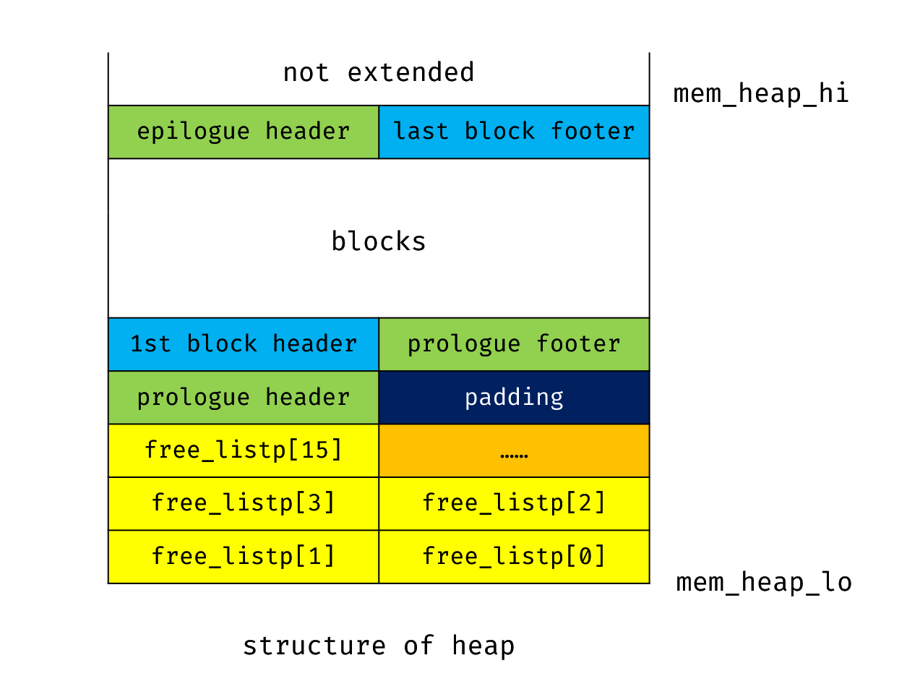
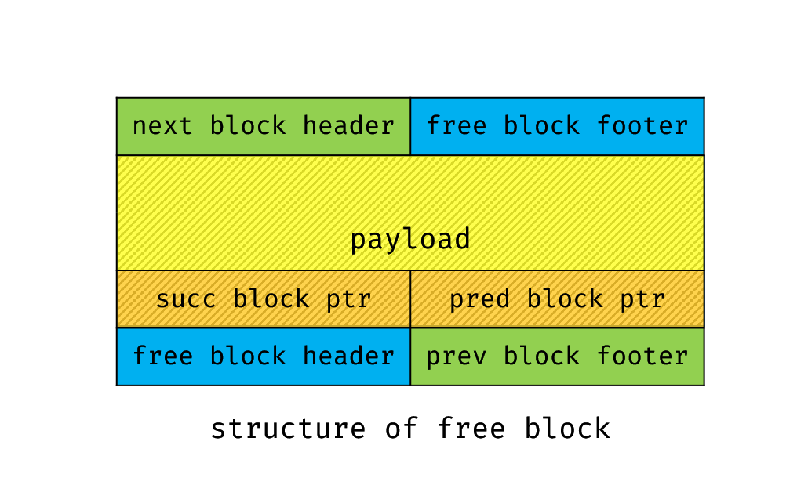

# Malloc Lab Report

## 测试结果

我的实现在课程集群上的测试结果如下：

```
Results for mm malloc:
trace            name     valid  util     ops      secs   Kops
 1     amptjp-bal.rep       yes   96%    5694  0.000279  20423
 2       cccp-bal.rep       yes   96%    5848  0.000267  21862
 3    cp-decl-bal.rep       yes   97%    6648  0.000347  19164
 4       expr-bal.rep       yes   99%    5380  0.000251  21451
 5 coalescing-bal.rep       yes   97%   14400  0.000334  43088
 6     random-bal.rep       yes   93%    4800  0.000382  12569
 7    random2-bal.rep       yes   91%    4800  0.000378  12692
 8     binary-bal.rep       yes   94%   12000  0.000281  42674
 9    binary2-bal.rep       yes   81%   24000  0.000489  49090
10    realloc-bal.rep       yes   99%   14401  0.000227  63329
11   realloc2-bal.rep       yes   87%   14401  0.000234  61438
Total                             94%  112372  0.003470  32382

Score = (56 (util) + 40 (thru)) * 11/11 (testcase) = 58/100
```

## 实现思路

采用显式空闲链表来组织空闲块，并使用 segregated fit 策略，按照 log2size 分配不同尺度的空闲块到不同的大小类中。搜索空闲链表时采用 first fit 策略。

对每个块，使用边界标记，以便在每次产生空闲块之后，进行边界合并。为了提高空间利用率，我进行了去脚优化，即空闲块具有头部和脚部，而已分配块只有头部。

针对部分操作具有明显特点的 trace，我进行了定制优化，同时保证这些优化不是 case-specified 的（即，我的程序对所有 trace 仍然执行相同的通用策略，并不会通过识别 trace 具体的内容更换策略，只是这种通用策略考虑到了部分特殊的 trace），满足实验的要求。

## 数据结构的精细表示

以下利用图表和文字结合的形式，展示我设计数据结构的精细结构。

对于接下来的描述，“字”指 8 Bytes (64 bits)，“双字”指 16 Bytes (128 bits)。

整个堆的结构如下图所示。堆向上生长，堆底部的 16 个字存放了显式空闲列表的 16 个大小类的头指针。紧接着，有 1 个无用的字用于对齐。之后是序言块的头部、序言块的脚部，各 1 个字。从这里开始排列所有普通的块，并保证每一块的 payload 起始位置双字对齐。在堆顶，有结尾块，其只有头部，占 1 个字。



每块的头部与脚部、已分配块内的结构都与 CSAPP 书上完全一致，后 4 个 bit 用于存放分配标记和前块分配标记，其余部分用于存放块大小。对于空闲块，取其 payload 的前 2 个字，分别作为指向其在链表中前驱、后继节点的指针。指向前驱、后继节点的指针具体指向位置都是相应块 payload 的起始地址；若该空闲块为链表头/尾，则前驱/后继指针置为 NULL。



## 实现过程

我渐进地完成本次实验。

CSAPP 第 9 章给出了一个隐式空闲链表的实现作为示例。我首先继承了课本上的全部代码，然后将其去脚，得到了去脚的隐式空闲链表实现。

接着，我以该实现作为框架，为空闲块添加了指针，将其改为（未分离的）显式空闲链表。

然后，我添加了将空闲块按照大小分类的代码，实现了分离的显式空闲链表，并且修改了课本上 naive 的 realloc 实现。

最后，我阅读了表现较差的 trace，进行了定制优化。

我的大部分函数在功能上都和 CSAPP 中的没有太多差别。下面介绍一些我新增的，或与课本有显著区别的代码（此处没有提及的，在提交的代码中有详细注释）。

为了实现去脚，我定义了一些宏用于简化操作：

``` c
/* for hidden footer */
#define PACK_ALL(size, prev_alloc, alloc) ((size) | (prev_alloc) | (alloc))
#define GET_PREV_ALLOC(p) (GET(p) & 0x2)
#define SET_PREV_ALLOC(p) (GET(p) |= 0x2)
#define SET_PREV_FREE(p) (GET(p) &= ~0x2)
```

它们分别用于设置已分配块的头部，获取当前块前一块的分配信息，和设置当前块前一块的分配信息。

我定义了一些用于操作显式空闲链表的宏：

``` c
/* for free blocks list */
#define PRED_NODE(bp) ((char *)(*(size_t *)(bp)))
#define SUCC_NODE(bp) ((char *)(*(size_t *)((char *)(bp) + WSIZE)))
#define SET_PRED(bp, val) (*(size_t *)(bp) = (size_t)(val))
#define SET_SUCC(bp, val) (*(size_t *)((char *)(bp) + WSIZE) = (size_t)(val))
```

这些宏都要求 bp 指向空闲块的 payload 起始部分。前两个宏获取当前块在显式空闲链表中的前驱和后继块，后两个宏用于设定当前块的前驱和后继。

定义了两个函数来向链表中插入和删除空闲块。由于我的空闲链表采用 LIFO 策略，因此插入操作永远插入到链表头。

``` c
/*
 * insert_node - insert a free block into the front of the free list
 */
static inline void insert_node(void *bp, size_t size)
{
  size_t idx = select_idx(size);
  char *head = free_listp[idx];
  free_listp[idx] = bp;
  if(head != NULL)
  {
    SET_PRED(bp, NULL);
    SET_SUCC(bp, head);
    SET_PRED(head, bp);
  }
  else /* original list is empty */
  {
    SET_PRED(bp, NULL);
    SET_SUCC(bp, NULL);
  }
}

/*
 * delete_node - delete a free block from the free list
 */
static inline void delete_node(void *bp)
{
  size_t size = GET_SIZE(HDRP(bp));
  size_t idx = select_idx(size);
  char *pred = PRED_NODE(bp);
  char *succ = SUCC_NODE(bp);
  if(pred == NULL) /* bp is the first block */
  {
    free_listp[idx] = succ;
    if(succ != NULL)
      SET_PRED(succ, NULL);
  }
  else
  {
    SET_SUCC(pred, succ);
    if(succ != NULL)
      SET_PRED(succ, pred);
  }
}
```

`select_idx` 函数用于根据块的大小选择链表的相应大小类，其实现非常暴力。

``` c
/*
 * select_idx - select index of free lists by block size
 */
static inline size_t select_idx(size_t size)
{
  if(size <= 16)
    return 0;
  else if(size <= 32)
    return 1;
  else if(size <= 64)
    return 2;
  else if(size <= 128)
    return 3;
  else if(size <= 256)
    return 4;
  else if(size <= 512)
    return 5;
  else if(size <= 1024)
    return 6;
  else if(size <= 2048)
    return 7;
  else if(size <= 4096)
    return 8;
  else if(size <= 8192)
    return 9;
  else if(size <= 16384)
    return 10;
  else if(size <= 32768)
    return 11;
  else if(size <= 65536)
    return 12;
  else if(size <= 131072)
    return 13;
  else if(size <= 262144)
    return 14;

  return 15;
}
```

由于本实验要求不能开全局数组，因此分离的显式空闲链表使用指针访问。

``` c
static char **free_listp = 0;

#define FREE_LIST_SIZE 16

/*
 * mm_init - initialize the malloc package.
 */
int mm_init(void)
{
  /* the start address of the heap is not 0!! */
  free_listp = mem_heap_lo();
  for(int i = 0; i < FREE_LIST_SIZE; i++)
  {
    if((heap_listp = mem_sbrk(WSIZE)) == (void *)-1)
        return -1;
    free_listp[i] = NULL;
  }
...
```

在 `mm_init` 刚开始时，将所有链表的头节点都赋为 NULL。

我修改了课本上给出的 `find_fit` 函数，使其能够搜索显式空闲链表。

``` c
static inline void *find_fit(size_t asize)
{
  void *bp;
  size_t idx = select_idx(asize);
  while(idx < FREE_LIST_SIZE) /* search the whole list from idx */
  {
    /* search current entry */
    for(bp = free_listp[idx]; bp != NULL; bp = SUCC_NODE(bp))
      if(GET_SIZE(HDRP(bp)) >= asize)
        return bp;
    idx++;
  }
  return NULL;
}
```

由于我的优化涉及到一些分割空闲块的操作，我编写了 `split_block` 函数。

``` c
/*
 * split_block - split a block into two blocks
 * @return: the pointer to the new free block
 */
static inline void *split_block(void *bp, size_t asize)
{
  size_t csize = GET_SIZE(HDRP(bp));
  PUT(HDRP(bp), PACK_ALL(asize, GET_PREV_ALLOC(HDRP(bp)), 1));
  PUT(HDRP(NEXT_BLKP(bp)), PACK_ALL(csize - asize, 2, 0));
  PUT(FTRP(NEXT_BLKP(bp)), PACK_ALL(csize - asize, 2, 0));
  /* splitting has generated a new free block */
  insert_node(NEXT_BLKP(bp), csize - asize);
  return NEXT_BLKP(bp);
}
```

我重新实现了 `mm_realloc`，会在下一节详细解释。

## 优化定制

通过阅读 traces 的 README 和观察文件，发现 `{coalescing, binary, binary2, realloc, realloc2}-bal.rep` 的操作存在明显规律，因此选择对这些 traces 进行定制优化。

`coalescing-bal.rep` 周期性地申请两块 4095 bytes 的内存，然后将其释放，紧接着申请一块 8190 bytes  的内存。我观察到，在我优化之前，这个测试点的 util 永远为 66%。导致这样结果的原因是，我从 CSAPP 上继承的代码中，`mm_init` 的行为是在最后申请 4096 bytes 的内存块作为第一个空闲块。由于 4095 加上对齐和块头之后大于 4096，因此第一个空闲块（大约占这个测试数据堆大小的 1/3）被永远浪费了。因此，我修改了 `mm_init`，把初始空闲块的大小改为了 2 个双字（允许的最小块大小）。

```c
/* optimize coalescing-bal.rep. don't extend as CHUNKSIZE (4096) */
if(extend_heap((2 * DSIZE) / WSIZE) == NULL)
  return -1;
```

`{binary, binary2}-bal.rep` 的操作类似，都是交错申请大小为 2 的幂的较小块和大小不为 2 的幂的较大块，然后释放所有较大块，再申请大量大小为 2 的幂的较大块。这样会使得前面释放的较大块无法用于之后的分配，导致外部碎片的出现。我写了一个函数用于调整每次分配的块大小，将特定大小的块向上调整为 2 的幂，以应对之后的分配操作。

``` c
/*
 * magic - this is a magic function to adjust block size.
 */
static inline size_t magic(size_t size)
{
  /* optmize {binary, binary2}-bal.rep */
  if(size >= 112 && size < 128)
    return 128;
  if(size >= 448 && size < 512)
    return 512;

  return size;
}
```

`{realloc, realloc2}-bal.rep` 要求我必须实现一个高效的 `mm_realloc`。我进行了以下的优化：

若申请的 size 小于等于原先块具有的 size，则无需重新分配，直接返回；

若原先块的后一块空闲且空间足够，则直接占用后一块，不迁移原有数据，必要时可以分割后一块；

``` c
  size_t old_payload_size = GET_SIZE(HDRP(ptr)) - WSIZE;
  /* current block has enough space */
  if(asize <= old_payload_size)
  {
    if((old_payload_size - asize) >= (2 * DSIZE))
      split_block(ptr, asize);
    return ptr;
  }
  /* the next block is free, occupy it */
  else if(GET_SIZE(HDRP(NEXT_BLKP(ptr))) && !GET_ALLOC(HDRP(NEXT_BLKP(ptr))))
  {
    size_t next_size = GET_SIZE(HDRP(NEXT_BLKP(ptr)));
    if(old_payload_size + next_size >= asize)
    {
      delete_node(NEXT_BLKP(ptr));
      SET_PREV_ALLOC(HDRP(NEXT_BLKP(NEXT_BLKP(ptr))));
      PUT(HDRP(ptr), PACK_ALL(copy_size + next_size, GET_PREV_ALLOC(HDRP(ptr)), 1));
      if(copy_size + next_size - asize >= (2 * DSIZE))
        split_block(ptr, asize);   
      return ptr;
    }
  }
```

进行了这些优化之后，我观察到 `realloc2-bal.rep` 仍然不够好。注意到这个 trace 中包含大量在堆顶 realloc 更大空间的操作，我添加了针对性的优化，若 realloc 操作的下一块是堆顶，直接扩展堆，免去了数据转移的操作。

``` c
  /* the next block is epilogue, extend heap instantly */
  else if(!GET_SIZE(HDRP(NEXT_BLKP(ptr))))
  {
    size_t extend_size = ALIGN(size - old_payload_size);
    if((long)mem_sbrk(extend_size) == -1)
      return NULL;
    PUT(HDRP(ptr), PACK_ALL(copy_size + extend_size, GET_PREV_ALLOC(HDRP(ptr)), 1));

    PUT(HDRP(NEXT_BLKP(ptr)), PACK(0, 1 | 2)); /* new epilogue header */
    return ptr;
  }
```

这有效地提升了我的得分。

在以上优化条件都不满足时，使用 malloc+free 的 naive 方式来实现 realloc 操作。

## 参考资料

CSAPP, Chapter 9.

内存管理：显式空闲链表 (https://zhuanlan.zhihu.com/p/378352199)